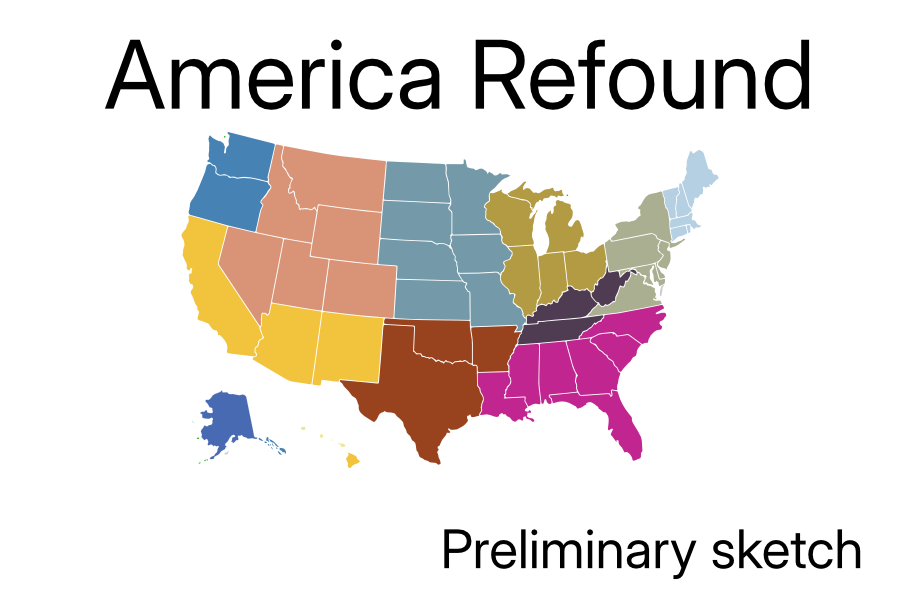

@def title = "Refounding America"
@def tags = ["syntax", "code"]

# The American Project at Age 249

Lincoln would say that we are again a house divided that cannot stand. He ended the division of his day by pulling down half the house, and his successors rebuilt that half along similar lines as the original. Johnson took a backhoe to that successor version, and Trump is busy building it back while undermining the foundations supporting the remainder.

It’s unlikely that the rest of the United States would let its parts go their own ways unless it was part of a general plan of reorganization. If that were to occur many thorny problems, such as defense, currency, inter-regional commerce and the like, would need to be addressed. However, if 37 states agree on amending the Constitution on the fundamental question of allowing for dissolution—a big if—I am assuming those problems away.

How that will play out will take more years to unfold than I have to observe the changes. What I can do is the thought experiment of taking my toys and going home by looking at what American breakaway republics might look like.

Here are my initial thoughts. Some states will have counties peeled off to join different nations, but the number and approximate locations will probably not much change.

